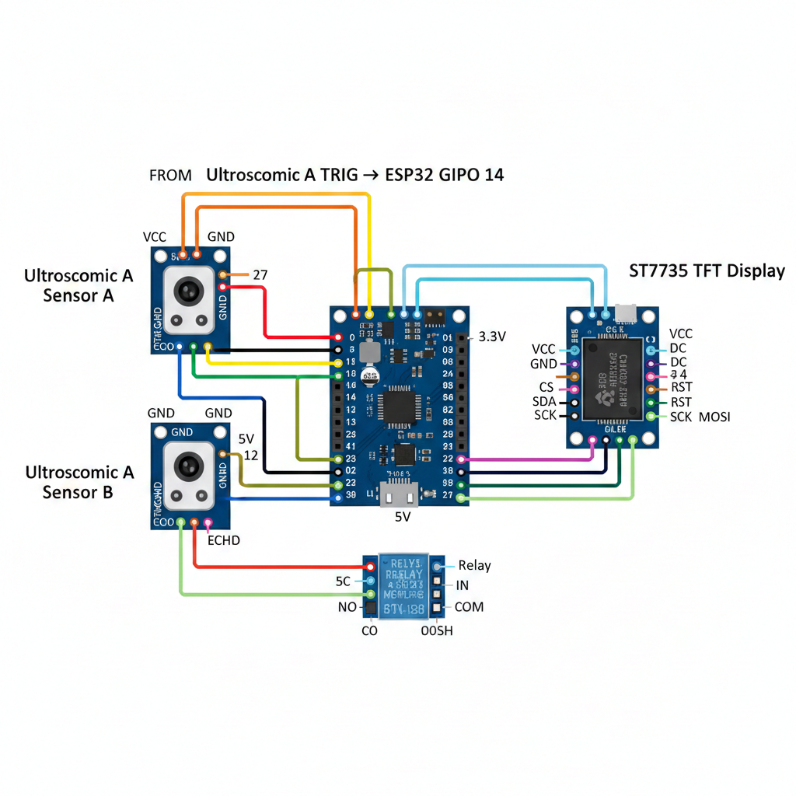

# RelayX - Power Saving Model

An Arduino/ESP32-based intelligent people counter that uses dual ultrasonic sensors to track room occupancy in real-time. The system features bidirectional detection, a color TFT display, and automated relay control based on occupancy.

---

## 📋 Table of Contents

- [Features](#features)
- [Hardware Requirements](#hardware-requirements)
- [Software Requirements](#software-requirements)
- [Circuit Diagram](#circuit-diagram)
- [Wiring Guide](#wiring-guide)
- [Installation](#installation)
- [How It Works](#how-it-works)
- [Usage](#usage)
- [Code Structure](#code-structure)
- [Troubleshooting](#troubleshooting)
- [Future Enhancements](#future-enhancements)
- [License](#license)

---

## ✨ Features
- **Bidirectional Detection**: Accurately counts people entering and exiting
- **Real-time Display**: Shows current occupancy count on 1.8" TFT screen
- **Smart Relay Control**: Automatically activates relay when room is occupied
- **Dual Sensor System**: Uses two ultrasonic sensors for direction detection
- **Timeout Protection**: Prevents false counts with sensor timeout logic
- **Debounce Handling**: Implements counting delays to avoid duplicate detections
- **Serial Monitoring**: Provides debug information via Serial Monitor

---

## 🛠️ Hardware Requirements

| Component | Specification | Quantity |
|-----------|---------------|----------|
| Microcontroller | ESP32 Development Board | 1 |
| Display | Adafruit ST7735 1.8" TFT LCD (128x160) | 1 |
| Ultrasonic Sensors | HC-SR04 | 2 |
| Relay Module | 5V Single Channel Relay | 1 |
| Power Supply | 5V DC (min 2A) | 1 |
| Jumper Wires | Male-to-Female & Male-to-Male | As needed |
| Breadboard | Standard Size (optional) | 1 |

---

## 💻 Software Requirements

- **Arduino IDE** (version 1.8.x or higher) or **PlatformIO**
- **Required Libraries**:
  - `Adafruit_GFX` (Graphics Core Library)
  - `Adafruit_ST7735` (Display Driver)
  - `SPI` (Comes with Arduino IDE)

### Installing Libraries

```bash
# Via Arduino IDE Library Manager:
1. Open Arduino IDE
2. Go to Sketch → Include Library → Manage Libraries
3. Search and install "Adafruit GFX Library"
4. Search and install "Adafruit ST7735 and ST7789 Library"
```

---

## 🔌 Circuit Diagram



---

## 📐 Wiring Guide

### TFT Display (ST7735) Connections

| TFT Pin | ESP32 Pin | Description |
|---------|-----------|-------------|
| VCC | 3.3V | Power Supply |
| GND | GND | Ground |
| CS | GPIO 5 | Chip Select |
| RESET | GPIO 4 | Reset |
| A0/DC | GPIO 2 | Data/Command |
| SDA | GPIO 23 (MOSI) | SPI Data |
| SCK | GPIO 18 (SCK) | SPI Clock |
| LED | 3.3V | Backlight (optional 100Ω resistor) |

### Ultrasonic Sensor A (Entry Detection)

| HC-SR04 Pin | ESP32 Pin | Description |
|-------------|-----------|-------------|
| VCC | 5V | Power Supply |
| TRIG | GPIO 14 | Trigger Pin |
| ECHO | GPIO 27 | Echo Pin |
| GND | GND | Ground |

### Ultrasonic Sensor B (Exit Detection)

| HC-SR04 Pin | ESP32 Pin | Description |
|-------------|-----------|-------------|
| VCC | 5V | Power Supply |
| TRIG | GPIO 13 | Trigger Pin |
| ECHO | GPIO 12 | Echo Pin |
| GND | GND | Ground |

### Relay Module

| Relay Pin | ESP32 Pin | Description |
|-----------|-----------|-------------|
| VCC | 5V | Power Supply |
| GND | GND | Ground |
| IN | GPIO 25 | Control Signal |

---

## 🚀 Installation

### Step 1: Hardware Setup

1. Connect all components according to the wiring guide above
2. Ensure all power connections are secure
3. Place the two ultrasonic sensors facing each other at the entry point
4. Position Sensor A on the outside and Sensor B on the inside

### Step 2: Software Setup

1. **Install Arduino IDE** (if not already installed)
   ```bash
   Download from: https://www.arduino.cc/en/software
   ```

2. **Install ESP32 Board Support**
   - Open Arduino IDE
   - Go to File → Preferences
   - Add to "Additional Boards Manager URLs":
     ```
     https://raw.githubusercontent.com/espressif/arduino-esp32/gh-pages/package_esp32_index.json
     ```
   - Go to Tools → Board → Boards Manager
   - Search for "ESP32" and install

3. **Install Required Libraries**
   - Install `Adafruit_GFX` library
   - Install `Adafruit_ST7735` library

4. **Upload the Code**
   - Open `sketch_jun10a.c` in Arduino IDE
   - Select your ESP32 board: Tools → Board → ESP32 Dev Module
   - Select the correct COM port: Tools → Port
   - Click Upload button

---

## 🔍 How It Works

### Detection Logic

The system uses a dual-sensor approach to determine the direction of movement:

1. **Entry Detection** (A → B sequence):
   - Person triggers Sensor A first
   - Then triggers Sensor B within 2 seconds
   - Counter increments by 1
   - Relay turns ON (if first person)

2. **Exit Detection** (B → A sequence):
   - Person triggers Sensor B first
   - Then triggers Sensor A within 2 seconds
   - Counter decrements by 1
   - Relay turns OFF (if room becomes empty)

3. **Timeout Protection**:
   - If only one sensor triggers and 3 seconds pass, the trigger is reset
   - Prevents false counts from incomplete passages

4. **Debounce Mechanism**:
   - 500ms delay after each successful count
   - Prevents duplicate counting of the same person


*Add flowchart or system operation diagram here*

### Display Information

The TFT screen shows:
- **Title**: "People Counter" (Yellow text)
- **Current Count**: "Count: X" (White text)
- **Background**: Black for better contrast

---

## 📱 Usage

### Starting the System

1. Power on the ESP32
2. The display will initialize and show "Count: 0"
3. The system is now ready to detect movement

### Monitoring via Serial

Open the Serial Monitor (115200 baud) to view debug messages:
- "Sensor A triggered" - Entry sensor detected
- "Sensor B triggered" - Exit sensor detected
- "Person entered - Count increased"
- "Person exited - Count decreased"
- "Sensor A/B timeout" - Sensor reset after timeout


---

## 📂 Code Structure

### Main Components

```c
// Pin Definitions
TFT_CS, TFT_RST, TFT_DC    // Display pins
TRIG_A, ECHO_A              // Entry sensor pins
TRIG_B, ECHO_B              // Exit sensor pins
RELAY_PIN                   // Relay control pin

// Global Variables
peopleCount                 // Current number of people
sensorATime, sensorBTime    // Trigger timestamps
sensorATriggered            // Entry sensor state
sensorBTriggered            // Exit sensor state
countingEnabled             // Debounce flag
```

### Key Functions

| Function | Purpose |
|----------|---------|
| `setup()` | Initialize hardware, display, and sensors |
| `loop()` | Main detection and counting logic |
| `getDistance()` | Measure distance using ultrasonic sensor |
| `updateDisplay()` | Refresh TFT screen with current count |

---

## 🔧 Troubleshooting

### Common Issues

| Problem | Possible Cause | Solution |
|---------|----------------|----------|
| Display not working | Wrong wiring or initialization | Check SPI connections and TFT library version |
| Count not changing | Sensors too far/close | Adjust sensor placement (2-100cm range) |
| False counts | Sensor interference | Ensure sensors are properly aligned |
| Relay not switching | Wrong GPIO or voltage | Verify GPIO 25 connection and relay voltage |
| Serial shows nothing | Wrong baud rate | Set Serial Monitor to 115200 baud |
| Count goes negative | Exit detection error | Code prevents negative counts (line 98) |

### Calibration Tips

- **Optimal sensor distance**: 30-50cm apart
- **Detection range**: 2-100cm from sensors
- **Height placement**: At waist level for best results
- **Timeout value**: Adjust 3000ms if needed (lines 111, 117)

---

## 🚧 Future Enhancements

Potential improvements for the project:

- [ ] Add WiFi connectivity for remote monitoring
- [ ] Implement data logging to SD card or cloud
- [ ] Create web dashboard for real-time statistics
- [ ] Add time-based analytics (peak hours tracking)
- [ ] Implement multi-room support
- [ ] Add buzzer for maximum capacity alerts
- [ ] Battery backup for power failure protection
- [ ] Temperature/humidity sensor integration
- [ ] Mobile app integration via Bluetooth/MQTT

---

## 📊 Technical Specifications

- **Detection Range**: 2-100 cm
- **Response Time**: ~50ms refresh rate
- **Timeout Period**: 3 seconds
- **Debounce Delay**: 500ms
- **Display Resolution**: 128x160 pixels
- **Operating Voltage**: 5V DC
- **Current Consumption**: ~200-300mA (typical)

---

## 📄 License

This project is licensed under the MIT License - see the [LICENSE](LICENSE) file for details.

You are free to use, modify, and distribute this project for personal, educational, and commercial purposes.

---

## 👨‍💻 Author

Created with ❤️ for IoT and embedded systems enthusiasts

---

## 🙏 Acknowledgments

- Adafruit for the excellent graphics libraries
- Arduino community for extensive documentation
- Espressif for ESP32 platform support

---